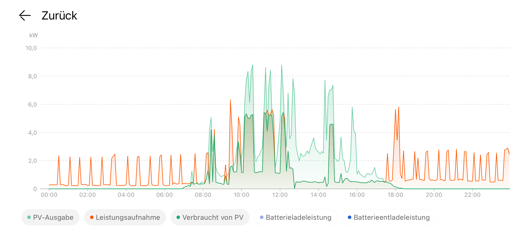

# PVPowerbox

## Table of contents
- [PVPowerbox](#pvpowerbox)
  - [Table of contents](#table-of-contents)
  - [Description](#description)
  - [Libraries](#libraries)
  - [Homepage](#homepage)
    - [Information Displayed](#information-displayed)
    - [RSSI (Signal Strength)](#rssi-signal-strength)
  - [Settings](#settings)
    - [Inverter](#inverter)
      - [IPAddress](#ipaddress)
      - [Port](#port)
      - [Interval (seconds)](#interval-seconds)
    - [Time Source (NTP)](#time-source-ntp)
      - [Use NTP server](#use-ntp-server)
      - [NTP server](#ntp-server)
      - [POSIX timezone string](#posix-timezone-string)
    - [Device](#device)
      - [Type](#type)
      - [Device Name](#device-name)
      - [Power (W)](#power-w)
      - [Power-off Delay (minutes)](#power-off-delay-minutes)
      - [Allowed ON from / until](#allowed-on-from--until)
      - [Relay](#relay)
      - [URL On / Off](#url-on--off)
      - [Partial Load Settings](#partial-load-settings)
    - [WiFi](#wifi)
      - [Default Password](#default-password)
      - [Default IP address](#default-ip-address)
      - [OTA](#ota)
      - [Configuration options](#configuration-options)
  - [Blinking codes](#blinking-codes)
  - [Reset](#reset)

## Description
The PVPowerbox allows loads to be switched on or off depending on the power available from the photovoltaics. In the picture you can see how the loads (red) are switched on and off, depending on the power (green) that is available. The regular peaks are from the heat pump, which is not controlled via the PVPowerbox

## Libraries
- [eModbus (ModbusClientTCP)](https://github.com/eModbus/eModbus) 
- [ESPAsyncWebServer](https://github.com/ESP32Async/ESPAsyncWebServer) 
- [AsyncTCP](https://github.com/ESP32Async/AsyncTCP) 
- [IotWebConf](https://github.com/minou65/IotWebConf) 
- [IotWebConfAsync](https://github.com/minou65/IotWebConfAsync) 
- [IotWebRoot](https://github.com/minou65/IotWebRoot) 
- [WebSerial](https://github.com/ayushsharma82/WebSerial)

## Homepage
The PVPowerbox provides a web interface that displays real-time information about your photovoltaic system and connected devices.

### Information Displayed

**Header**
- Current date and time
- RSSI (Signal Strength) - displayed in the top right corner

**Grid Section**
- Voltage A, B, C (in Volts)
- Current A, B, C (in Amperes)
- Active Power (in Watts)
- Power Direction (to Grid / from Grid)

**Inverter Section**
- Polling interval (in seconds)
- Standby status (Yes/No)
- Active Power (in Watts)

**Device Section**
Shows all configured devices with their current status indicated by colored indicators:
- **Off (Grey)**: Device is disabled/off
- **On (Green)**: Device is currently enabled/on
- **Delayed Off (Orange)**: Device will be switched off soon (delay period active)

**Network Section**
- MAC Address
- IP Address

**Quick Links**
- Link to the configuration page
- Link to WebSerial Console for live logs
- Software version

### RSSI (Signal Strength)
The RSSI is displayed in dBm at the top right of the homepage. RSSI is a measurement of how well your device can hear a signal from an access point or router.
- **Required for Amazing Signal Strength:** Around -30 dBm. Achievable only when the client device is very close to the access point (AP).
- **Very Good Signal Strength:** Approximately -67 dBm. Suitable for applications like VoIP/VoWi-Fi and streaming video.
- **Moderate Signal Strength:** Around -70 dBm.

## Settings
### Inverter
#### IPAddress
IP address of the inverter  
Default: 192.168.1.105

#### Port
Modbus TCP port of the inverter  
Default: 502  
Range: 1-65535

#### Interval (seconds)
This setting specifies the time interval in seconds between each polling of the inverter.  
Default: 10 seconds  
Range: 10-255 seconds

### Time Source (NTP)
#### Use NTP server
Enable or disable NTP time synchronization  
Default: Enabled

#### NTP server
NTP server address (FQDN or IP address)  
Default: pool.ntp.org

#### POSIX timezone string
POSIX timezone string for your location. This defines the timezone and daylight saving time rules.  
Default: CET-1CEST,M3.5.0,M10.5.0/3 (Central European Time)

Examples:
- CET-1CEST,M3.5.0,M10.5.0/3 (Central European Time)
- EST5EDT,M3.2.0,M11.1.0 (Eastern US Time)
- PST8PDT,M3.2.0,M11.1.0 (Pacific US Time)

### Device
Devices can be configured as either relay-controlled outputs or URL-controlled devices (e.g., Shelly switches).

#### Type
Select the type of device:
- **Relay**: Direct GPIO control for relay outputs
- **URL**: HTTP-based control for network devices (e.g., Shelly switches)

#### Device Name
Description/name of the device for identification purposes.

#### Power (W)
The minimum power from the photovoltaic system required for the device to be activated.

#### Power-off Delay (minutes)
Delay time in minutes before the device is switched off when the power falls below the power setting.  
Range: 1-300 minutes, default: 1 minute

#### Allowed ON from / until
Define a time window during which the device is allowed to be switched on.
- **Allowed ON from**: Start time (HH:MM format, default: 00:00)
- **Allowed ON until**: End time (HH:MM format, default: 23:59)

The device will not be activated outside of this time window.

#### Relay
For devices with Type = "Relay":

Select the relay to control:
- Relay 1 = GPIO 22
- Relay 2 = GPIO 21
- Relay 3 = GPIO 17
- Relay 4 = GPIO 16

#### URL On / Off
For devices with Type = "URL":

- **URL On**: HTTP URL to activate the device (e.g., http://192.168.1.100/relay/0?turn=on)
- **URL Off**: HTTP URL to deactivate the device (e.g., http://192.168.1.100/relay/0?turn=off)

#### Partial Load Settings
- **Allow Partial Load Activation**: Enable this to allow the device to be activated with partial solar power
- **Partial Load Threshold**: Threshold value between 0.0 and 1.0 for partial load activation

### WiFi

#### Default Password
When not connected to an AP the default password is 123456789

#### Default IP address
When in AP mode, the default IP address is 192.168.4.1

#### OTA 
OTA is enabled, use default IP address or if connected to an AP the correct address.
Port is the default port.

#### Configuration options
After the first boot, there are some values that need to be set up.
These items are marked with __*__ (star) in the list below.

You can set up the following values in the configuration page:

-  __Thing name__ - Please change the name of the device to
a name you think describes it the most. It is advised to
incorporate a location here in case you are planning to
set up multiple devices in the same area. You should only use
English letters, and the "_" underscore character. Thus, must not
use Space, dots, etc. E.g. `lamp_livingroom` __*__
- __AP password__ - This password is used, when you want to
access the device later on. You must provide a password with at least 8,
at most 32 characters.
You are free to use any characters, furthermore you are
encouraged to pick a password at least 12 characters long containing
at least 3 character classes. __*__
- __WiFi SSID__ - The name of the WiFi network you want the device
to connect to. __*__
- __WiFi password__ - The password of the network above. Note, that
unsecured passwords are not supported in your protection. __*__

## Blinking codes
In previous chapters, blinking patterns were mentioned, now here is a
table summarizing the meaning of the blink codes.

- __Rapid blinking__ (mostly on, interrupted by short off periods) -
Entered Access Point mode. This means the device creates its own WiFi
network around it. You can connect to the device with your smartphone
(or WiFi capable computer).
- __Alternating on/off blinking__ - Trying to connect the configured
WiFi network.
- __Mostly off with occasional short flash__ - The device is online.

## Reset
When CONFIG_PIN is pulled to ground on startup, the Thing will use the initial
password to build an AP. (E.g. in case of lost password)

Reset pin is D3 / IO17
